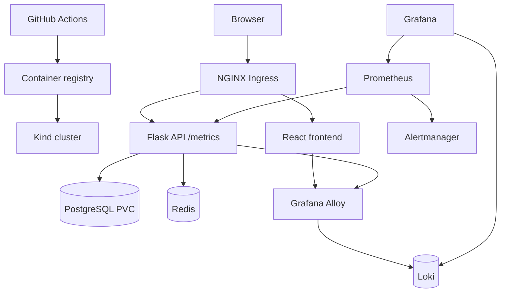

# Platform Engineering Home Lab

A production-inspired local Kubernetes platform for practicing the workflows of a Platform Engineer and SRE. It deploys a small React + Flask application backed by PostgreSQL and Redis, then layers in ingress, observability, autoscaling, security controls, CI, and operational practice.

## What this demonstrates

- **Kubernetes operations:** Helm releases, Deployments, StatefulSets, Services, PVCs, ingress, health probes, resource controls, and HPA.
- **Observability:** Prometheus application metrics, Grafana dashboards, Alertmanager rules, and centralized Kubernetes logging with Grafana Alloy and Loki.
- **Security:** dedicated namespaces and service accounts, non-root containers, least-privilege RBAC, default-deny network policies, image scanning, SBOMs, and Kyverno admission policy.
- **Reliability:** availability and latency SLOs, error-budget policy, failure-injection exercises, incident runbooks, and Velero-backed recovery practice.
- **Delivery:** GitHub Actions validates the API, builds images, renders Helm, and can deploy to a local Kind cluster.

## Architecture



## Quick start

Prerequisites: Docker, [Kind](https://kind.sigs.k8s.io/), `kubectl`, and Helm 3.

```bash
make cluster
export POSTGRES_PASSWORD='<strong local password>'
export BACKUP_ACCESS_KEY='<local MinIO access key>'
export BACKUP_SECRET_KEY='<strong local MinIO secret key>'
make bootstrap
make verify
```

Add `127.0.0.1 platform.local` to your hosts file, then open `http://platform.local`. See [docs/getting-started.md](docs/getting-started.md) for complete instructions and [docs/operations.md](docs/operations.md) for validation and troubleshooting.

## Repository guide

| Path | Purpose |
| --- | --- |
| `apps/api` | Flask service, tests, container image, Prometheus metrics |
| `apps/frontend` | React/Vite single-page frontend |
| `charts/platform-home-lab` | One reusable Helm chart for the complete workload |
| `infra/kind` | Reproducible Kind cluster configuration |
| `infra/observability` | Prometheus/Grafana/Alertmanager configuration |
| `observability` | Pinned Loki and Grafana Alloy Helm configuration |
| `docs` | Architecture, SLOs, runbooks, roadmap, operating guides |

## Validation evidence

- [GitHub Container Registry and Argo CD release](docs/evidence/ghcr-argo-release-validation.md)
- [Argo CD self-healing](docs/evidence/argocd-self-healing-test.md)
- [Horizontal Pod Autoscaler](docs/evidence/hpa-scaling-test.md)
- [Kyverno policy, Velero backup, and recovery](docs/evidence/policy-backup-recovery-validation.md)

For a concise end-to-end presentation, use the [demo walkthrough](docs/demo.md).

## Delivery roadmap

The implemented baseline includes automated CI/CD, Argo CD GitOps, metrics, alerting, autoscaling, and centralized logging. Future increments are tracked in [docs/roadmap.md](docs/roadmap.md).

## Safety notes

The default PostgreSQL credentials are intentionally local-development values. Never copy them into a shared cluster. Rotate them and use an external secret manager before any real deployment.
