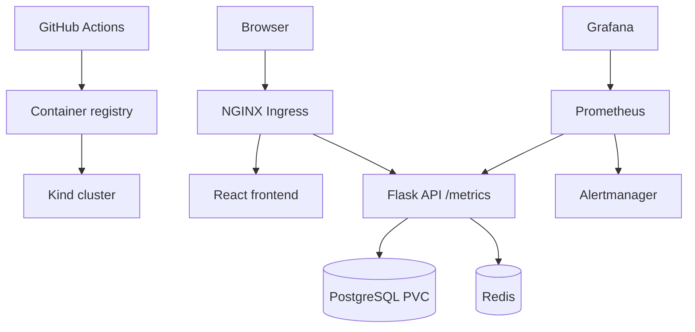

# Platform Engineering Home Lab

A production-inspired local Kubernetes platform for practicing the workflows of a Platform Engineer and SRE. It deploys a small React + Flask application backed by PostgreSQL and Redis, then layers in ingress, observability, autoscaling, security controls, CI, and operational practice.

## What this demonstrates

- **Kubernetes operations:** Helm releases, Deployments, StatefulSets, Services, PVCs, ingress, health probes, resource controls, and HPA.
- **Observability:** Prometheus scraping of application metrics, Grafana dashboards, Alertmanager rules, and a clear path to Loki.
- **Security:** dedicated namespace and service account, non-root containers, least-privilege RBAC, and default-deny network policies.
- **Reliability:** availability and latency SLOs, error-budget policy, failure-injection exercises, and incident runbooks.
- **Delivery:** GitHub Actions validates the API, builds images, renders Helm, and can deploy to a local Kind cluster.

## Architecture



## Quick start

Prerequisites: Docker, [Kind](https://kind.sigs.k8s.io/), `kubectl`, and Helm 3.

```bash
make cluster
make ingress
make deploy
make observability
```

Add `127.0.0.1 platform.local` to your hosts file, then open `http://platform.local`. See [docs/getting-started.md](docs/getting-started.md) for complete instructions and [docs/operations.md](docs/operations.md) for validation and troubleshooting.

## Repository guide

| Path | Purpose |
| --- | --- |
| `apps/api` | Flask service, tests, container image, Prometheus metrics |
| `apps/frontend` | React/Vite single-page frontend |
| `charts/platform-home-lab` | One reusable Helm chart for the complete workload |
| `infra/kind` | Reproducible Kind cluster configuration |
| `infra/observability` | Prometheus/Grafana/Alertmanager configuration |
| `docs` | Architecture, SLOs, runbooks, roadmap, operating guides |

## Delivery roadmap

The implemented baseline covers Milestones 1–7. The next GitHub-ready increments are captured in [docs/roadmap.md](docs/roadmap.md): Argo CD (GitOps), Loki (logs), and controlled reliability exercises.

## Safety notes

The default PostgreSQL credentials are intentionally local-development values. Never copy them into a shared cluster. Rotate them and use an external secret manager before any real deployment.
